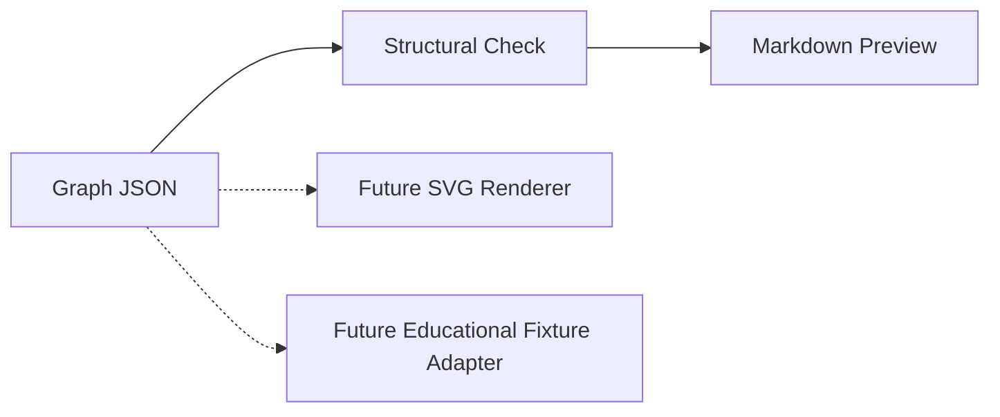

# Project Atlas Graph v0.1

## Purpose

Atlas Graph v0.1 introduces a shared, machine-readable source for Atlas concepts and relationships. Markdown previews are the first renderer. Future renderers may emit SVG, site-native diagrams, or educational fixture inputs from the same graph records.

## Data Flow

## Stability Boundary

The preview contract fixes node types, maturity labels, and relationship labels for v0.1. Consumers should ignore unrecognized `renderHints` properties so display guidance can grow without changing graph meaning. New semantic fields require a schema revision.

## Current Examples

- [Observer Journey](example_observer_journey.graph.json)
- [Observer Grammar](example_observer_grammar.graph.json)

## What This Establishes

The repository now has a structured graph vocabulary and deterministic descriptive preview path. This is infrastructure for documentation and future adapters only.

## Claim Boundary

No parity claim.
No scientific validation claim.
No proof claim.
