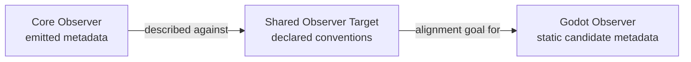

# Observer Bridge Diagram

The shared target is a declared alignment reference. It does not merge the observers or establish equivalent output.

Current bridge language preserves `runtimeExecuted=false` and `parityClaim=NONE`. No pixel comparison is represented here.

Related evidence: [Project Glowing Heart v1.8 Observer Milestone](../../../xPRIMEray/project_glowing_heart_v1_8_milestone.md).

Return to [Visual Wayfinding](../visual_wayfinding.md).

## Claim Boundary

No parity claim.
No physics validation claim.
No claim that artistic or speculative visualizations are scientific proof.
