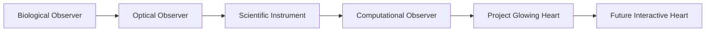

# Observer Journey Diagram

The route is a suggested reading sequence. Each stop remains a distinct observer territory with its own receiver, measurement, artifact, and claim boundary. Later stops do not replace or outrank earlier ones.

Continue with the full [Observer Journey](../observer_journey.md) or the shared [Observer Grammar](../observer_grammar.md).

## Claim Boundary

No parity claim.
No physics validation claim.
No claim that artistic or speculative visualizations are scientific proof.
