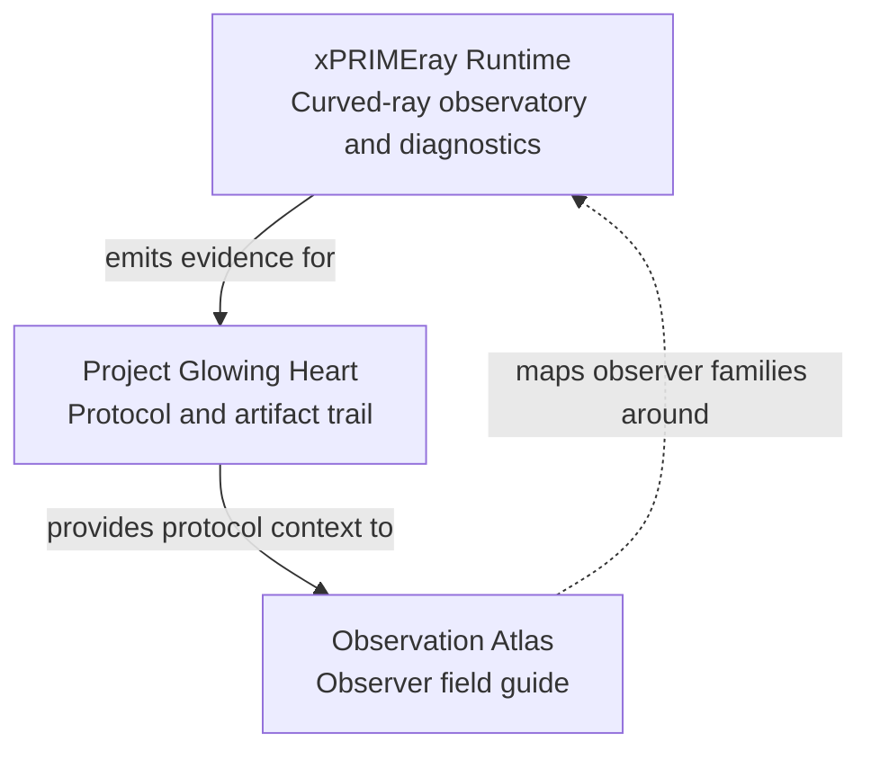

# Three-Layer Stack

## Reading Key

- **xPRIMEray Runtime** is the engine, observatory, and diagnostics territory.
- **Project Glowing Heart** records fixtures, observers, snapshots, measurements, artifacts, and comparison eligibility.
- **Observation Atlas** maps the broader observer families that contextualize those protocols.

This stack is editorial wayfinding. It is not a maturity ranking or an implementation dependency diagram.

Return to [Visual Wayfinding](../visual_wayfinding.md).

## Claim Boundary

No parity claim.
No physics validation claim.
No claim that artistic or speculative visualizations are scientific proof.
