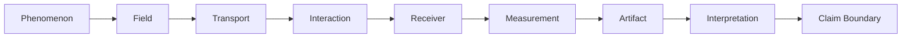

# Observer Grammar

Use this sequence when reading or writing any Atlas territory — biological, optical, scientific, computational, or educational. It answers one question in nine steps: *what happened between the phenomenon and the claim?*

The Observer Grammar expands Rule 2 of the [Atlas Constitution](ATLAS_CONSTITUTION.md). It is the shared sequence for describing biological, optical, scientific, computational, and educational observers. It is a translation frame, not an equivalence claim.

Same chart for every observer family. Shared nodes aid navigation; they do not imply equivalent physics or measurement.

## The nine nodes (what to record at each step)

### Phenomenon

Name the subject of observation, not the picture of it. Separate the phenomenon from the image, signal, or model later used to represent it. For speculative or computational entries, state whether the phenomenon is physical, simulated, conceptual, or unknown.

### Field

Identify what carries or structures the phenomenon. Examples may include an electromagnetic field, refractive-index field, particle population, surface interaction, scene description, or computational state. Record domain, variables, and assumptions where known.

### Transport

Describe how the carrier evolves from source toward the observer. Name propagation, integration, scattering, projection, sampling, or other transformation rules. Distinguish implemented transport from an analogy or artistic device.

### Interaction

Describe what occurs at the observer boundary or sensing region. Examples include absorption, reflection, collision, transduction, probe response, rasterization, or a numerical sample. State selection effects and losses.

### Receiver

Identify the component that records the interaction and its sensitivity, range, resolution, geometry, and operating conditions. A camera, retina, photodiode, probe tip, virtual film, or classification routine can be a receiver under different observer families.

### Measurement

State what the number *means*, not only how it is stored. Declare the recorded quantity, units, calibration, normalization, dynamic range, uncertainty, and channel semantics. Unknown values remain explicit. Similar storage layouts do not establish comparable measurements.

### Artifact

Identify the persistent evidence produced from the measurement, such as a table, image, spectrum, mesh, manifest, snapshot, or report. Record format, provenance, revision, and transformations needed to inspect it.

### Interpretation

State the reasoning that connects the artifact to a claim. Separate direct reading from derived analysis, inference, analogy, and speculation. Cite evidence that allows a reader to inspect the reasoning.

### Claim Boundary

End here. State what may and may not be concluded. Classify conclusions as `Supported`, `Inferred`, or `Unknown` under the Constitution. Name prohibited conclusions directly when a representation could invite overreading. No observer entry is complete if this node is absent.

## When is an entry complete?

Every node is answered or marked `Unknown`. Stopping at Artifact without Interpretation and Claim Boundary leaves the reader guessing what the evidence supports. Treating analogy as a documented transform overstates the case.

For project-wide reading limits, see [Reading boundary](README.md#reading-boundary).