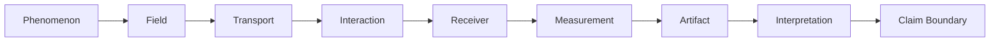

# Observer Grammar

The Observer Grammar expands Doctrine 2 of the [Atlas Constitution](ATLAS_CONSTITUTION.md). It is the shared sequence for describing biological, optical, scientific, computational, and educational observers. It is a translation frame, not an equivalence claim.

## Grammar Nodes

### Phenomenon

Name what is being observed. Separate the phenomenon from the image, signal, or model later used to represent it. For speculative or computational entries, state whether the phenomenon is physical, simulated, conceptual, or unknown.

### Field

Identify what carries or structures the phenomenon. Examples may include an electromagnetic field, refractive-index field, particle population, surface interaction, scene description, or computational state. Record domain, variables, and assumptions where known.

### Transport

Describe how the carrier evolves from source toward the observer. Name propagation, integration, scattering, projection, sampling, or other transformation rules. Distinguish implemented transport from an analogy or artistic device.

### Interaction

Describe what occurs at the observer boundary or sensing region. Examples include absorption, reflection, collision, transduction, probe response, rasterization, or a numerical sample. State selection effects and losses.

### Receiver

Identify the component that records the interaction and its sensitivity, range, resolution, geometry, and operating conditions. A camera, retina, photodiode, probe tip, virtual film, or classification routine can be a receiver under different observer families.

### Measurement

Declare the recorded quantity, units, calibration, normalization, dynamic range, uncertainty, and channel semantics. Unknown values remain explicit. Similar storage layouts do not establish comparable measurements.

### Artifact

Identify the persistent evidence produced from the measurement, such as a table, image, spectrum, mesh, manifest, snapshot, or report. Record format, provenance, revision, and transformations needed to inspect it.

### Interpretation

State the reasoning that connects the artifact to a claim. Separate direct reading from derived analysis, inference, analogy, and speculation. Cite evidence that allows a reader to inspect the reasoning.

### Claim Boundary

Classify conclusions as `Supported`, `Inferred`, or `Unknown` under the Constitution. Name prohibited conclusions directly when a representation could invite overreading. No observer entry is complete if this node is absent.

## Completion Rule

Every node must be answered or explicitly marked `Unknown`. An entry that stops at Artifact, silently fills an unknown, or treats analogy as a transform is incomplete.

## Claim Boundary

No parity claim.
No physics validation claim.
No claim that artistic or speculative visualizations are scientific proof.
