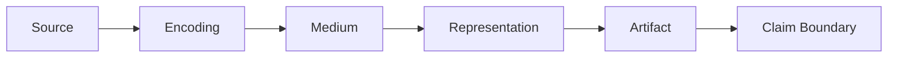

# Representation Grammar

The Representation Grammar describes how source material becomes a persistent form that a reader can inspect. It complements the [Observer Grammar](observer_grammar.md) and the Representation Principle in the [Atlas Constitution](ATLAS_CONSTITUTION.md).

## Source

The source is the phenomenon, measurement, dataset, model, simulation state, or prior artifact from which the representation begins. Record provenance, revision, acquisition conditions, and whether the source is observed, generated, inferred, or speculative.

## Encoding

Encoding is the selection and transformation applied to the source. Examples include sampling, quantization, normalization, projection, color mapping, classification, interpolation, compression, annotation, or aggregation. Declare information discarded or introduced by the encoding.

## Medium

The medium is the carrier through which the encoding is presented: pixels, print, text, audio, geometry, animation, interactive controls, or another display system. Medium constraints can alter scale, color, timing, resolution, and accessibility.

## Representation

The representation is the organized form perceived by the reader, such as an image, graph, spectrum, diagram, map, animation, or interactive scene. Name whether it is a direct measurement view, derived diagnostic, conceptual diagram, artistic interpretation, or speculative visualization.

## Artifact

The artifact is the persistent file or object that preserves the representation and its evidence trail. Record path, format, version, provenance, source references, transform references, and reproducibility instructions where applicable.

## Claim Boundary Node

The claim boundary states what the artifact supports, what is inferred, and what remains unknown. It must account for every transformation between Source and Artifact. Visual clarity, realism, or resemblance does not expand the supported claim.

## Use Rule

Changing any node can create a different representation even when the source is unchanged. Two artifacts require a declared comparison basis and, where necessary, a documented transform before their representations can be treated as comparable.

## Claim Boundary

No parity claim.
No physics validation claim.
No claim that artistic or speculative visualizations are scientific proof.
