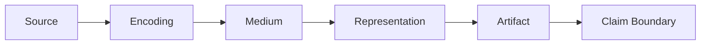

# Representation Grammar

The Observer Grammar follows signal *into* the receiver. The Representation Grammar follows evidence *out* to the reader — through encoding choices, medium, and the file or view you actually inspect.

The Representation Grammar describes how source material becomes a persistent form that a reader can inspect. It complements the [Observer Grammar](observer_grammar.md) and the Representation Principle in the [Atlas Constitution](ATLAS_CONSTITUTION.md).

If two representations look alike, check this chain before assuming they measure the same thing.

## Source

The source is the phenomenon, measurement, dataset, model, simulation state, or prior artifact from which the representation begins. Record provenance, revision, acquisition conditions, and whether the source is observed, generated, inferred, or speculative.

## Encoding

Encoding is the selection and transformation applied to the source. Examples include sampling, quantization, normalization, projection, color mapping, classification, interpolation, compression, annotation, or aggregation. Declare information discarded or introduced by the encoding.

## Medium

The medium is the carrier through which the encoding is presented: pixels, print, text, audio, geometry, animation, interactive controls, or another display system. Medium constraints can alter scale, color, timing, resolution, and accessibility.

## Representation

The representation is the organized form perceived by the reader, such as an image, graph, spectrum, diagram, map, animation, or interactive scene. Name whether it is a direct measurement view, derived diagnostic, conceptual diagram, artistic interpretation, or speculative visualization.

## Artifact

The artifact is the persistent file or object that preserves the representation and its evidence trail. Record path, format, version, provenance, source references, transform references, and reproducibility instructions where applicable.

## Claim boundary (required last step)

State what the artifact supports, what is inferred, and what remains unknown — including every transform from Source to Artifact. A clear or realistic image does not, by itself, support a stronger claim.

## Before comparing two representations

A change at any node — encoding, medium, normalization, annotation — can produce a different representation from the same source. Two artifacts need a stated comparison basis and, when required, a documented transform. Resemblance is not equivalence.

For project-wide reading limits, see [Reading boundary](README.md#reading-boundary).