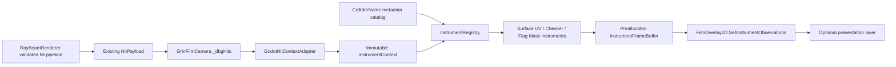

# Project Optical Closure Stage 1 Plan

## Summary

Build a Godot-free Observer Instrumentation library downstream of the sovereign `HitPayload` pipeline. Instruments receive an immutable DTO projection of existing hit data and can neither raycast nor mutate transport/classification state.

Repository findings:

- `HitPayload` is produced by `RayBeamRenderer` and by the film pass’s existing resolved-hit path.
- `_dbgHits` is populated in two branches of `GrinFilmCamera`, near lines 17236 and 20474.
- `FilmOverlay2D.SetData(...)` copies `_dbgHits` near line 20646.
- `ColliderName` is populated only when `NeedColliderNames=true`.
- There is no existing unit-test project.
- Safest Stage 1C attachment: evaluate the completed `_dbgHits` span once beside `SetData(...)`, covering both population branches without editing either branch.

Verdict: **safe to implement Stage 1A now; Stage 1C and the July 4 fixture are not safe until Stage 1A/1B tests and allocation checks pass.**

## Framework Design

### Public Types

Create a Godot-free `XPrimeRay.ObserverInstrumentation` library:

- `InstrumentContext`: readonly struct containing ray index, sovereign-hit availability, hit position/normal, collider name, and translated termination disposition. Use `System.Numerics.Vector3`; omit `ColliderId`.
- `InstrumentObservation`: readonly struct containing ray index, instrument ID, diagnostic state, UV values, sample flags, and existing collider-name reference.
- `IObserverInstrument`: allocation-free `Observe(in InstrumentContext, in InstrumentTargetMetadata, out InstrumentObservation)`.
- `InstrumentRegistry`: setup-time registry with fixed instrument order and an enabled bitmask. Seal before frame evaluation.
- `InstrumentFrameBuffer`: preallocated `InstrumentObservation[]`, indexed by ray and instrument slot; resizing allowed only outside per-ray evaluation.
- `InstrumentMetadataCatalog`: immutable-after-build dictionary keyed with `StringComparer.Ordinal` by unique `ColliderName`.
- `InstrumentDiagnosticState`: `RegionSampled`, `ProbeHitOutsideRegion`, `OtherGeometryHit`, `TransportClassNotSurfaceHit`, `DiagnosticUnresolved`.
- `ObserverInstrumentMask`: `None`, `SurfaceUv`, `CheckerProbe`, `FlagCapture`.

Instrument #001 consists of:

- `SurfaceUvInstrument`: analytic spherical UV from normalized `(hitPosition - declaredCenter)`.
- `CheckerProbeInstrument`: checker parity derived from UV and declared tile counts.

Instrument #002:

- `FlagCaptureInstrument`: reveal-mask classifier only.
- Stable presentation labels: `flag_region_sampled`, `probe_hit_outside_flag_region`, `other_geometry_hit`, `transport_class_not_surface_hit`, `diagnostic_unresolved`.
- It does not classify flag colors, stars, stripes, or pixels.
- The declared reveal mask is one normalized UV rectangle with seam-aware U bounds.

### Deterministic Math Rules

- Spherical mapping:
  - `u = wrap01(0.5 + atan2(z, x)/(2π))`
  - `v = 0.5 - asin(clamp(y,-1,1))/π`
  - poles use deterministic `u=0.5`.
- Zero-length/non-finite vectors return failure and produce `DiagnosticUnresolved`.
- Checker coordinates wrap U, clamp V, require positive tile counts, and use integer parity.
- Missing initialized metadata for a valid named hit means `OtherGeometryHit`.
- An unavailable/invalid catalog means `DiagnosticUnresolved`.
- A miss or non-surface termination means `TransportClassNotSurfaceHit`.
- No exceptions, logging, collections, formatting, or allocations are permitted in the per-ray path.

### Dependency Diagram



## Implementation Stages

### Stage 1A: Pure Math Only

- Add the Godot-free library and zero-package console test runner.
- Implement only spherical UV, checker parity, and UV-region helpers.
- Do not add interfaces, metadata loading, renderer references, scenes, or overlay integration.
- Add projects to the solution; the test runner exits non-zero on any failed assertion.

### Stage 1B: Framework and Synthetic Hits

- Add immutable DTOs, registry, frame buffer, metadata catalog, and all three instruments.
- Construct metadata directly in tests; no JSON loader or scene integration yet.
- Reject duplicate/empty `ColliderName` keys at catalog build time.
- Seal catalog and registry before evaluation.
- Verify all fail-closed states and fixed-slot frame-buffer ordering.
- Use `GC.GetAllocatedBytesForCurrentThread` after warm-up over at least 100,000 evaluations; expected hot-path delta is zero.

### Stage 1C: Film/Debug Bus Attachment

Touch only `GrinFilmCamera.cs`, `FilmOverlay2D.cs`, and a new Godot adapter file.

- Add a tiny `GodotHitContextAdapter` converting existing Godot vectors and `HitPayload` fields into `InstrumentContext`.
- Require both the instrumentation feature mask and existing `NeedColliderNames=true`. If names are disabled, instrumentation remains disabled and logs once; do not alter collision-query behavior.
- Evaluate the completed `_dbgHits.AsSpan(0, _dbgRayCount)` once immediately beside the existing `SetData(...)` call. Do not edit the two hit writers.
- Mirror debug-buffer capacity in `InstrumentFrameBuffer`; no per-band allocation after warm-up.
- Add `FilmOverlay2D.SetInstrumentObservations(ReadOnlySpan<InstrumentObservation>)`.
- Preserve `SetData(...)` exactly.
- `ClearOverlay()` also clears observation counts.
- Stage 1C stores observations only; it adds no drawing behavior.

### July 4 Fixture Plan

Create only new fixture files after Stage 1C passes:

- New “Capture the Flag USA” scene, controller, metadata JSON, and flag asset.
- Use a uniquely named probe collider and dedicated observer pose.
- Configure `FlagCaptureInstrument` with one declared UV reveal region.
- Aggregate `FlagRegionSampled` observations to trigger a whole-flag reveal in a separate presentation `Control`; do not create a per-pixel flag mask.
- Public wording: curved transport from this configured observer pose sampled the declared reveal region.
- Explicitly avoid parity, physical correctness, proof, or real-world optics claims.
- Do not modify an existing fixture or scene.

## Proposed File Tree and Commits

```text
src/XPrimeRay.ObserverInstrumentation/
  Abstractions/
    IObserverInstrument.cs
    InstrumentContext.cs
    InstrumentObservation.cs
    InstrumentEnums.cs
  Math/
    SphericalUvMath.cs
    CheckerProbeMath.cs
    UvRevealRegion.cs
  Metadata/
    InstrumentMetadataCatalog.cs
    InstrumentTargetMetadata.cs
  Runtime/
    InstrumentRegistry.cs
    InstrumentFrameBuffer.cs
  Instruments/
    SurfaceUvInstrument.cs
    CheckerProbeInstrument.cs
    FlagCaptureInstrument.cs
  XPrimeRay.ObserverInstrumentation.csproj

src/XPrimeRay.ObserverInstrumentation.Tests/
  Program.cs
  TestAssert.cs
  SphericalUvTests.cs
  CheckerProbeTests.cs
  MetadataCatalogTests.cs
  InstrumentTests.cs
  AllocationTests.cs
  XPrimeRay.ObserverInstrumentation.Tests.csproj

ObserverInstrumentation/
  GodotHitContextAdapter.cs

Fixtures/OpticalClosure/                 # later demo commit only
  CaptureTheFlagUsaController.cs
  capture_the_flag_usa.instrumentation.json
  capture_the_flag_usa.png

test-optical-closure-capture-the-flag-usa.tscn  # new scene only
```

Minimum commits:

1. Scaffold Godot-free library and self-contained test runner.
2. Add spherical UV/checker/reveal-region math and Stage 1A tests.
3. Add immutable abstractions, metadata catalog, registry, and frame buffer.
4. Add Instruments #001/#002 and synthetic/allocation tests.
5. Add Godot adapter and storage-only Stage 1C integration.
6. Add integration diagnostics for both debug-hit production modes.
7. Add the new July 4 fixture and simulation-bounded documentation.

## Tests, Risks, and Guardrails

### Required Tests

- Canonical normals: ±X, ±Y, ±Z with fixed UV expectations.
- Non-unit normalization, poles, seam wrapping, zero and non-finite vectors.
- Checker transitions, 6×6 and 8×8 parity, invalid tile counts.
- Reveal rectangle inside/outside and seam-crossing cases.
- Valid probe hit, valid non-probe hit, miss/non-surface termination, missing catalog, missing metadata, duplicate collider names.
- Registry enable/disable behavior and deterministic instrument ordering.
- Frame-buffer capacity reuse, count reset, and no stale observations.
- 100,000-call zero-allocation test after warm-up.
- Stage 1C compile test plus manual verification of both threaded/local and ordinary `_dbgHits` paths.
- Confirm `SetData(...)` signature is byte-for-byte unchanged.

### Primary Risks

| Risk | Mitigation |
|---|---|
| Collider-name collisions | Reject duplicates at metadata build time; require unique scene names. |
| Collider names omitted | Require existing `NeedColliderNames=true`; disable and warn once otherwise. |
| Instrumentation changes hit truth | DTO is readonly and contains no mutation/raycast capability. |
| Per-ray allocations | Struct DTOs/outputs, sealed arrays, preallocated frame buffer, allocation test. |
| One debug branch bypassed | Evaluate the final `_dbgHits` span once, after either writer completes. |
| Metadata unavailable | Emit `DiagnosticUnresolved`; never guess defaults. |
| Feature accidentally active | Instrument mask defaults to `None`; remove integration by deleting the additive call and fields. |
| Flag spectacle overstates results | Reveal is an aggregate presentation response to a declared UV region from one pose. |

### Files That Must Not Be Touched

- `RayBeamRenderer.cs`
- `GodotAdapter/SnapshotBuilder.cs`
- `RendererCore/Testing/RenderTestRunner.cs`
- `GrinObserveDemoHud.cs`
- `RendererCore/Scheduling/ObjectProbeOracle.cs`
- `RendererCore/Scheduling/ObjectSeededTileScheduler.cs`
- everything under `RendererCore/Transport/`
- everything under `RendererCore/Fields/`
- everything under `schemas/glowing_heart/`
- `reports/observatory_catalog.json`
- every existing fixture JSON and scene file
- the existing `FilmOverlay2D.SetData(...)` signature
- existing hit classification, intersection, transport, and geometry-truth logic

**Final verdict:** Stage 1A is safe to implement. Stage 1B proceeds only after Stage 1A passes. Stage 1C remains gated on Stage 1B correctness and zero-allocation results. The July 4 fixture remains gated on storage-only Stage 1C verification.
