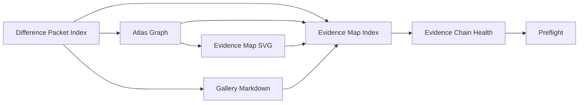

# Project Glowing Heart v2.13 Evidence Chain Release Candidate

## Release Candidate Summary

Project Glowing Heart v2.x is now a release candidate for a Core-vs-Core evidence-chain system. It records comparison decisions and presents them through a gallery, Atlas Graph, SVG evidence map, discovery index, health report, and repeatable preflight.

This release candidate freezes the current architecture and its boundaries. It does not promote preview schemas to stable or add comparison behavior.

## Version Timeline

| Version | Milestone |
|---|---|
| v2.0 | Difference Packet |
| v2.0.1 | Difference Packet hardening |
| v2.1 | Channel Registry and Compatibility Matrix |
| v2.1.1 | Registry hardening |
| v2.2 | Retained Core Snapshot Pair |
| v2.2.1 | Retained comparison hardening |
| v2.3 | Deliberate Core Difference Fixtures |
| v2.3.1 | Reproducibility repair |
| v2.4 | Difference Packet Gallery |
| v2.5 | NotComparable Channel Artifact |
| v2.6 | Difference Packet Index |
| v2.7 | Gallery Renderer |
| v2.7.1 | Gallery claim guards |
| v2.8 | Atlas Graph Bridge |
| v2.8.1 | Bridge hardening |
| v2.9 | Evidence Map SVG |
| v2.10 | Evidence Map Index |
| v2.11 | Evidence Chain Health Check |
| v2.12 | Preflight Runner |
| v2.13 | Evidence Chain Release Candidate |

## Canonical Sources and Generated Views

Canonical sources are the structured records and code from which the visitor-facing chain is checked or regenerated:

- `reports/glowing_heart_v2_6_difference_packet_index.preview.json`
- `Docs/Observatory/Observation_Atlas/Atlas_Graph/glowing_heart_difference_packet_exhibits.graph.json`
- `reports/glowing_heart_v2_10_evidence_map_index.preview.json`
- contracts under `schemas/glowing_heart/` and `schemas/atlas_graph/`
- retained inputs under `Fixtures/`
- generators and validators under `tools/`

Generated views are:

- Difference Packet Gallery Markdown
- Evidence Map SVG and Markdown preview
- generated preview reports
- Evidence Chain health reports
- preflight report

Generated views should be regenerated from canonical sources. Exhibit values in generated Gallery or evidence-map views should not be hand-edited.

## Evidence Chain



The arrows describe artifact generation and synchronization checks, not runtime or architecture dependencies.

## Locked Boundaries

- Core-vs-Core only.
- No Godot comparison.
- No image or pixel comparison.
- No parity claim.
- No physical validation claim.
- No renderer equivalence claim.
- No proof claim.
- Zero difference between deterministic Core packets does not establish equivalence with another runtime or measurement system.
- Non-zero difference demonstrates numeric distinction between retained Core artifacts only.

## Release Candidate Criteria

The release candidate is ready when all of the following hold:

- `python3 tools/glowing_heart_preflight.py` returns zero.
- The v2.11 health report records `PASS`.
- Five exhibits are present: two `Comparable`, two `Unknown`, and one `NotComparable`.
- The Atlas Graph passes its shared validator.
- The Evidence Map SVG has five exhibit cards, no scripts, and no external links.
- MkDocs builds successfully.
- `XPrimeRay.Core` remains free of Godot dependencies.
- Protected files remain untouched by this milestone.

At the v2.13 verification point, every criterion above passes.

## Preview to Stable Criteria

Moving from preview to stable requires a separate decision and all of these conditions:

- approve explicit stable schema versions and compatibility policy
- adopt the Evidence Chain preflight in the selected CI or release process
- complete at least one external audit pass
- review public documentation and index language
- define stable naming and retention policy for generated artifacts
- reproduce the chain from a clean clone
- confirm no known broken links in Glowing Heart pages

The v2.13 release candidate does not itself satisfy or waive these promotion criteria.

## Regeneration Commands

```bash
python3 tools/glowing_heart_gallery_renderer.py \
  reports/glowing_heart_v2_6_difference_packet_index.preview.json \
  reports/glowing_heart_v2_4_difference_packet_gallery.preview.md \
  Docs/xPRIMEray/project_glowing_heart_v2_4_difference_packet_gallery.md

python3 tools/glowing_heart_index_to_atlas_graph.py \
  reports/glowing_heart_v2_6_difference_packet_index.preview.json \
  Docs/Observatory/Observation_Atlas/Atlas_Graph/glowing_heart_difference_packet_exhibits.graph.json

python3 tools/atlas_graph_evidence_map_renderer.py \
  Docs/Observatory/Observation_Atlas/Atlas_Graph/glowing_heart_difference_packet_exhibits.graph.json \
  reports/glowing_heart_v2_9_evidence_map.svg \
  reports/glowing_heart_v2_9_evidence_map.preview.md

python3 tools/glowing_heart_evidence_map_index.py

python3 tools/glowing_heart_evidence_chain_health.py \
  --output-json reports/glowing_heart_v2_11_evidence_chain_health.preview.json \
  --output-md reports/glowing_heart_v2_11_evidence_chain_health.preview.md

python3 tools/glowing_heart_preflight.py
```

## What This Does Not Demonstrate

This release candidate documents and checks artifact synchronization. It is not a Godot comparison, image or pixel comparison, parity result, physical validation, renderer equivalence, proof, or claim of scientific correctness.

## Future v3.0 Direction

**Glowing Heart v3.0 — Observer Fixture Dashboard Seed**

Generalize the current five-case evidence set into a dashboard model for multiple observer, fixture, and channel combinations while preserving the same claim boundaries and generated-artifact chain. This direction is not implemented in v2.13.
