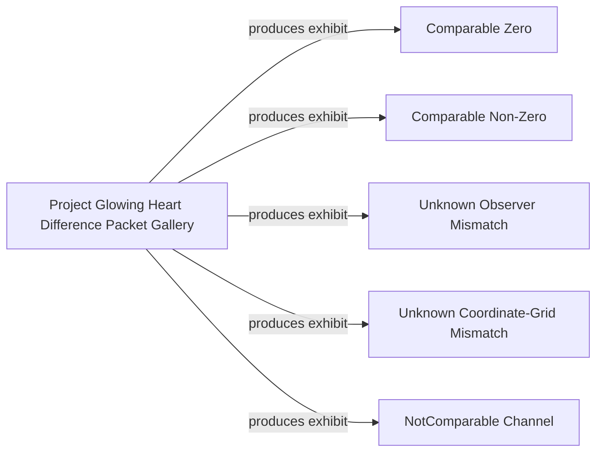

# Glowing Heart Difference Packet Exhibits (Preview)

**The Atlas is a map of observation systems, not a ranking of technologies.**

Atlas Graph representation of the five structured Difference Packet Gallery exhibits.

Graph ID: `glowing_heart.difference_packet_exhibits`

Version: `v0.1`

## In plain terms

Read this graph as an evidence map of comparison decisions, not as a ranking or correctness ladder.

## Claim Boundary

Core-vs-Core only. Not a Godot comparison. Not image or pixel comparison. Not parity. Not physical validation. Not renderer equivalence. Index validity describes exhibit structure, not scientific correctness.

## Diagram

## Nodes

| ID | Label | Type | Category | Evidence depth | Description | Claim Boundary |
|---|---|---|---|---|---|---|
| glowing_heart_difference_packet_gallery | Project Glowing Heart Difference Packet Gallery | project | Glowing Heart | Experimental | Structured gallery of retained Core Difference Packet decision exhibits. | Core-vs-Core artifact gallery only; not parity, validation, physical correctness, or renderer equivalence. |
| comparable_zero | Comparable Zero | artifact | Difference Packet Exhibit | Experimental | Matching retained Core fixture comparison identity, observer basis, channel, and coordinate grid produced zero numeric difference. | Core-vs-Core only. Not a Godot comparison. Not image or pixel comparison. Not parity. Zero difference does not establish equivalence with another runtime or measurement system. |
| comparable_nonzero | Comparable Non-Zero | artifact | Difference Packet Exhibit | Experimental | The declared-compatible amplitude variant produced non-zero numeric differences in retained Core bend values. | Core-vs-Core only. Not a Godot comparison. Not image or pixel comparison. Not parity. Non-zero difference demonstrates numeric distinction between retained Core artifacts only. |
| unknown_observer_mismatch | Unknown Observer Mismatch | artifact | Difference Packet Exhibit | Experimental | The retained observer basis mismatch made comparison eligibility unknown, so values were not compared. | Core-vs-Core only. Not a Godot comparison. Not image or pixel comparison. Not parity. Unknown means eligibility was not established. |
| unknown_coordinate_grid_mismatch | Unknown Coordinate-Grid Mismatch | artifact | Difference Packet Exhibit | Experimental | The retained coordinate-grid mismatch made comparison eligibility unknown, so values were not compared. | Core-vs-Core only. Not a Godot comparison. Not image or pixel comparison. Not parity. Unknown means eligibility was not established. |
| not_comparable_channel | NotComparable Channel | artifact | Difference Packet Exhibit | Experimental | Bend magnitude and traversal step count are incompatible retained Core channels without a declared transform, so values were not compared. | Core-vs-Core only. Not a Godot comparison. Not image or pixel comparison. Not parity. No bend data was relabeled as traversal steps. |

## Edges

| ID | From | To | Relationship | Label | Claim Boundary |
|---|---|---|---|---|---|
| gallery_produces_comparable_zero | glowing_heart_difference_packet_gallery | comparable_zero | produces | produces exhibit | Artifact relationship only; it does not imply ranking, correctness, or comparison eligibility beyond the recorded matrix decision. |
| gallery_produces_comparable_nonzero | glowing_heart_difference_packet_gallery | comparable_nonzero | produces | produces exhibit | Artifact relationship only; it does not imply ranking, correctness, or comparison eligibility beyond the recorded matrix decision. |
| gallery_produces_unknown_observer_mismatch | glowing_heart_difference_packet_gallery | unknown_observer_mismatch | produces | produces exhibit | Artifact relationship only; it does not imply ranking, correctness, or comparison eligibility beyond the recorded matrix decision. |
| gallery_produces_unknown_coordinate_grid_mismatch | glowing_heart_difference_packet_gallery | unknown_coordinate_grid_mismatch | produces | produces exhibit | Artifact relationship only; it does not imply ranking, correctness, or comparison eligibility beyond the recorded matrix decision. |
| gallery_produces_not_comparable_channel | glowing_heart_difference_packet_gallery | not_comparable_channel | produces | produces exhibit | Artifact relationship only; it does not imply ranking, correctness, or comparison eligibility beyond the recorded matrix decision. |

## Evidence

| Label | Reference | Kind |
|---|---|---|
| Difference Packet Index | `reports/glowing_heart_v2_6_difference_packet_index.preview.json` | report |
| Difference Packet Index Schema | `schemas/glowing_heart/difference_packet_index.v0.preview.json` | schema |
| Channel Registry | `Docs/xPRIMEray/glowing_heart/channel_registry.preview.json` | artifact |
| Compatibility Matrix | `Docs/xPRIMEray/glowing_heart/channel_compatibility_matrix.preview.json` | artifact |

## Status

This preview describes graph structure only.

No parity claim.
No scientific validation claim.
No proof claim.
