# Observer Grammar (Preview)

The shared descriptive sequence used to document an observer from phenomenon through claim boundary.

Graph ID: `atlas.observer_grammar.v0_1`

Version: `v0.1`

## Claim Boundary

Shared grammar does not imply shared physics or measurement equivalence.

## Nodes

| ID | Label | Type | Category | Maturity | Description | Claim Boundary |
|---|---|---|---|---|---|---|
| phenomenon | Phenomenon | grammar_node | observer_grammar | Prototype | The physical, computational, conceptual, or unknown subject being observed. | The phenomenon is distinct from its representation. |
| field | Field | grammar_node | observer_grammar | Prototype | The carrier or structure through which the phenomenon is expressed. | A declared field model is not a broad physical conclusion. |
| transport | Transport | grammar_node | observer_grammar | Prototype | The declared evolution or propagation toward an observer. | Implemented transport and analogy must remain distinct. |
| interaction | Interaction | grammar_node | observer_grammar | Prototype | The event at the sensing boundary or interaction region. | Selection effects and losses remain explicit. |
| receiver | Receiver | grammar_node | observer_grammar | Prototype | The biological, optical, instrumental, or computational component that records an interaction. | Shared receiver vocabulary does not imply shared mechanisms. |
| measurement | Measurement | grammar_node | observer_grammar | Prototype | The recorded quantity with declared units, range, calibration, and channel semantics. | Different measurement channels require an explicit comparison basis. |
| artifact | Artifact | grammar_node | observer_grammar | Prototype | The persistent object that preserves the measurement or its representation. | An artifact preserves evidence within its recorded provenance and scope. |
| interpretation | Interpretation | grammar_node | observer_grammar | Prototype | The stated reasoning that connects an artifact to a bounded conclusion. | Direct reading, inference, analogy, and speculation remain labeled. |
| claim_boundary | Claim Boundary | grammar_node | observer_grammar | Prototype | The explicit supported, inferred, and unknown limits of the entry. | No observer entry is complete without this boundary. |

## Edges

| ID | From | To | Relationship | Label | Claim Boundary |
|---|---|---|---|---|---|
| phenomenon_describes_field | phenomenon | field | describes | describes | Sequence describes structure, not causation. |
| field_describes_transport | field | transport | describes | describes | Sequence describes structure, not causation. |
| transport_describes_interaction | transport | interaction | describes | describes | Sequence describes structure, not causation. |
| interaction_describes_receiver | interaction | receiver | describes | describes | Sequence describes structure, not causation. |
| receiver_describes_measurement | receiver | measurement | describes | describes | Sequence describes structure, not causation. |
| measurement_describes_artifact | measurement | artifact | describes | describes | Sequence describes structure, not causation. |
| artifact_describes_interpretation | artifact | interpretation | describes | describes | Sequence describes structure, not causation. |
| interpretation_describes_claim_boundary | interpretation | claim_boundary | describes | describes | Sequence describes structure, not causation. |

## Diagram

```mermaid
flowchart LR
    phenomenon["Phenomenon"]
    field["Field"]
    transport["Transport"]
    interaction["Interaction"]
    receiver["Receiver"]
    measurement["Measurement"]
    artifact["Artifact"]
    interpretation["Interpretation"]
    claim_boundary["Claim Boundary"]
    phenomenon -->|describes| field
    field -->|describes| transport
    transport -->|describes| interaction
    interaction -->|describes| receiver
    receiver -->|describes| measurement
    measurement -->|describes| artifact
    artifact -->|describes| interpretation
    interpretation -->|describes| claim_boundary
```

## Evidence

| Label | Reference | Kind |
|---|---|---|
| Atlas Constitution | `Docs/Observatory/Observation_Atlas/ATLAS_CONSTITUTION.md` | repository_doc |
| Observer Grammar | `Docs/Observatory/Observation_Atlas/observer_grammar.md` | repository_doc |

## Status

This preview describes graph structure only.

No parity claim.
No scientific validation claim.
No proof claim.
