# Observer Journey (Preview)

A suggested reading route across observer families and Project Glowing Heart toward a future interactive workbench.

Graph ID: `atlas.observer_journey.v0_1`

Version: `v0.1`

## Claim Boundary

Navigation aid, not a ranking or maturity ladder.

## Nodes

| ID | Label | Type | Category | Maturity | Description | Claim Boundary |
|---|---|---|---|---|---|---|
| human_eye | Human Eye | observer | biological_observer | Prototype | Biological receiver entry point for the Atlas reading route. | Atlas context only; no equivalence with computational cameras. |
| microscope | Microscope | observer | optical_observer | Prototype | Optical assembly example connecting biological reception to instrument-mediated observation. | Conceptual territory marker; no instrument model is implemented. |
| scientific_instrument | Scientific Instrument | territory | scientific_instrument | Prototype | Atlas territory for calibrated receivers and declared measurement channels. | Descriptive category only; no external instrument agreement is asserted. |
| computational_observer | Computational Observer | observer | computational_observer | Experimental | Simulation camera, transport observer, or diagnostic receiver represented in software. | Computational output is not interchangeable with biological or laboratory measurement. |
| project_glowing_heart | Project Glowing Heart | project | protocol_program | Experimental | Protocol and artifact trail for fixtures, observers, measurements, and comparison eligibility. | Protocol infrastructure does not establish output equivalence. |
| future_interactive_heart | Future Interactive Heart | future | future_observatory | Vision | Planned fixture-authoring workbench that writes back to traceable artifacts. | Planned direction only; no implementation is represented by this node. |

## Edges

| ID | From | To | Relationship | Label | Claim Boundary |
|---|---|---|---|---|---|
| eye_to_microscope | human_eye | microscope | reading_path | reading path | Navigation sequence only; not a ranking. |
| microscope_to_instrument | microscope | scientific_instrument | reading_path | reading path | Navigation sequence only; not a ranking. |
| instrument_to_computational | scientific_instrument | computational_observer | reading_path | reading path | Navigation sequence only; not a ranking. |
| computational_to_glowing_heart | computational_observer | project_glowing_heart | contextualizes | protocol context | Context does not imply equivalence. |
| glowing_heart_to_interactive | project_glowing_heart | future_interactive_heart | planned | planned | Future direction only. |

## Diagram

```mermaid
flowchart LR
    human_eye["Human Eye"]
    microscope["Microscope"]
    scientific_instrument["Scientific Instrument"]
    computational_observer["Computational Observer"]
    project_glowing_heart["Project Glowing Heart"]
    future_interactive_heart["Future Interactive Heart"]
    human_eye -->|reading path| microscope
    microscope -->|reading path| scientific_instrument
    scientific_instrument -->|reading path| computational_observer
    computational_observer -->|protocol context| project_glowing_heart
    project_glowing_heart -->|planned| future_interactive_heart
```

## Evidence

| Label | Reference | Kind |
|---|---|---|
| Observer Journey | `Docs/Observatory/Observation_Atlas/observer_journey.md` | repository_doc |
| Atlas Constitution | `Docs/Observatory/Observation_Atlas/ATLAS_CONSTITUTION.md` | repository_doc |

## Status

This preview describes graph structure only.

No parity claim.
No scientific validation claim.
No proof claim.
