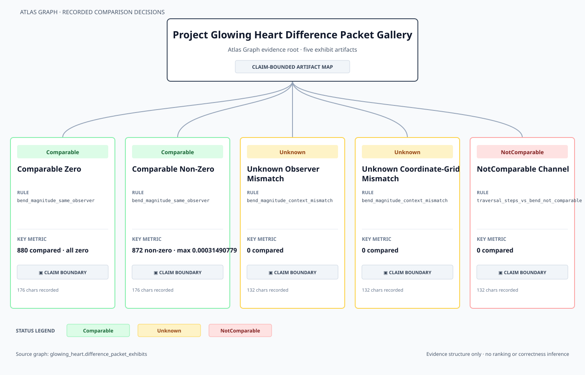

# Glowing Heart v2.9 Evidence Map Preview

A compact Atlas Graph rendering of five recorded Difference Packet decisions.

## Nodes

| Exhibit | Status | Rule | Key metric | Claim boundary |
|---|---|---|---|---|
| Comparable Zero | `Comparable` | `bend_magnitude_same_observer` | 880 compared · all zero | Recorded |
| Comparable Non-Zero | `Comparable` | `bend_magnitude_same_observer` | 872 non-zero · max 0.00031490779 | Recorded |
| Unknown Observer Mismatch | `Unknown` | `bend_magnitude_context_mismatch` | 0 compared | Recorded |
| Unknown Coordinate-Grid Mismatch | `Unknown` | `bend_magnitude_context_mismatch` | 0 compared | Recorded |
| NotComparable Channel | `NotComparable` | `traversal_steps_vs_bend_not_comparable` | 0 compared | Recorded |

## Status Legend

- `Comparable`: 2 exhibit(s)
- `Unknown`: 2 exhibit(s)
- `NotComparable`: 1 exhibit(s)
- `RequiresTransform`: 0 exhibit(s)

## Claim Boundary

Every exhibit displays a Claim Boundary indicator. Boundary text remains in the source graph and is not parsed to infer status.

Source graph: `Docs/Observatory/Observation_Atlas/Atlas_Graph/glowing_heart_difference_packet_exhibits.graph.json`

## What This Does Not Show

- Core-vs-Core only.
- Not a Godot comparison.
- Not image or pixel comparison.
- Not parity.
- Not physical validation.
- Not renderer equivalence.
- The evidence map renders recorded comparison decisions only; it does not validate scientific correctness.
