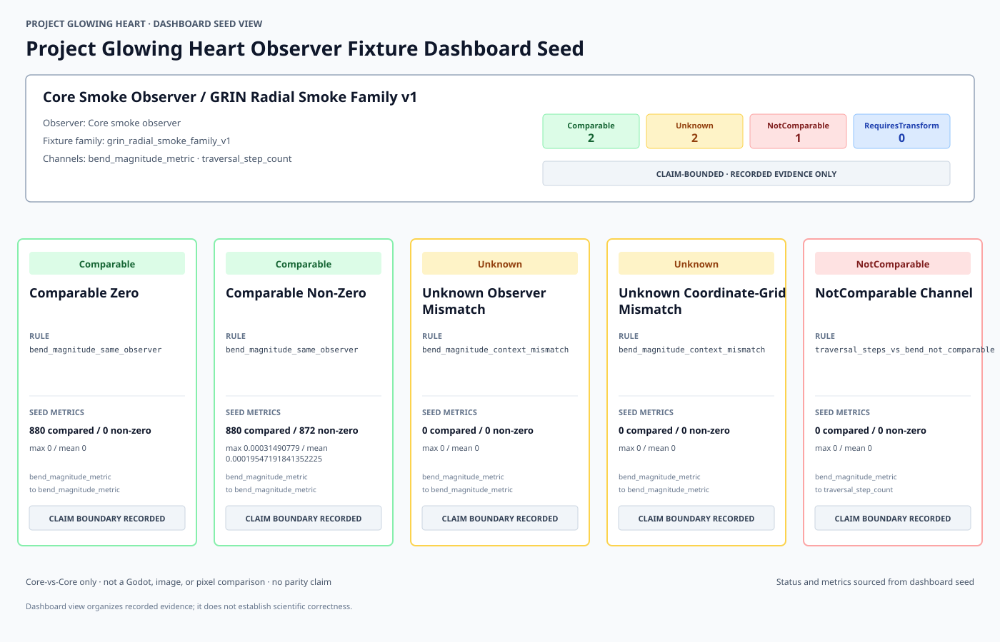

# Glowing Heart v3.1 Observer Fixture Dashboard Preview

<!-- Generated by tools/glowing_heart_dashboard_renderer.py. Do not edit exhibit values by hand. -->

Rendered from `reports/glowing_heart_v3_0_dashboard_seed.preview.json` version `v0.preview`.

## Dashboard Group

| Observer | Fixture family | Channels | Exhibits |
|---|---|---|---:|
| Core smoke observer | `grin_radial_smoke_family_v1` | `bend_magnitude_metric`, `traversal_step_count` | 5 |

## Status Counts

| Status | Count |
|---|---:|
| `Comparable` | 2 |
| `Unknown` | 2 |
| `NotComparable` | 1 |
| `RequiresTransform` | 0 |

## Exhibits

| Exhibit | Status | Rule | Compared | Maximum difference | Mean difference | Non-zero |
|---|---|---|---:|---:|---:|---:|
| Comparable Zero | `Comparable` | `bend_magnitude_same_observer` | 880 | 0 | 0 | 0 |
| Comparable Non-Zero | `Comparable` | `bend_magnitude_same_observer` | 880 | 0.00031490779 | 0.00019547191841352225 | 872 |
| Unknown Observer Mismatch | `Unknown` | `bend_magnitude_context_mismatch` | 0 | 0 | 0 | 0 |
| Unknown Coordinate-Grid Mismatch | `Unknown` | `bend_magnitude_context_mismatch` | 0 | 0 | 0 | 0 |
| NotComparable Channel | `NotComparable` | `traversal_steps_vs_bend_not_comparable` | 0 | 0 | 0 | 0 |

## Exhibit Claim Boundaries

### Comparable Zero

- Core-vs-Core only.
- Not a Godot comparison.
- Not image or pixel comparison.
- Not parity.
- Zero difference does not establish equivalence with another runtime or measurement system.

### Comparable Non-Zero

- Core-vs-Core only.
- Not a Godot comparison.
- Not image or pixel comparison.
- Not parity.
- Non-zero difference demonstrates numeric distinction between retained Core artifacts only.

### Unknown Observer Mismatch

- Core-vs-Core only.
- Not a Godot comparison.
- Not image or pixel comparison.
- Not parity.
- Unknown means eligibility was not established.

### Unknown Coordinate-Grid Mismatch

- Core-vs-Core only.
- Not a Godot comparison.
- Not image or pixel comparison.
- Not parity.
- Unknown means eligibility was not established.

### NotComparable Channel

- Core-vs-Core only.
- Not a Godot comparison.
- Not image or pixel comparison.
- Not parity.
- No bend data was relabeled as traversal steps.

## Dashboard Claim Boundary

- Core-vs-Core only.
- Not a Godot comparison.
- Not image or pixel comparison.
- Not parity.
- Not physical validation.
- Not renderer equivalence.
- Dashboard seed organizes recorded evidence only; it does not validate scientific correctness.

Status and metric values are rendered directly from the dashboard seed. No status is inferred from color, text, or topology.
