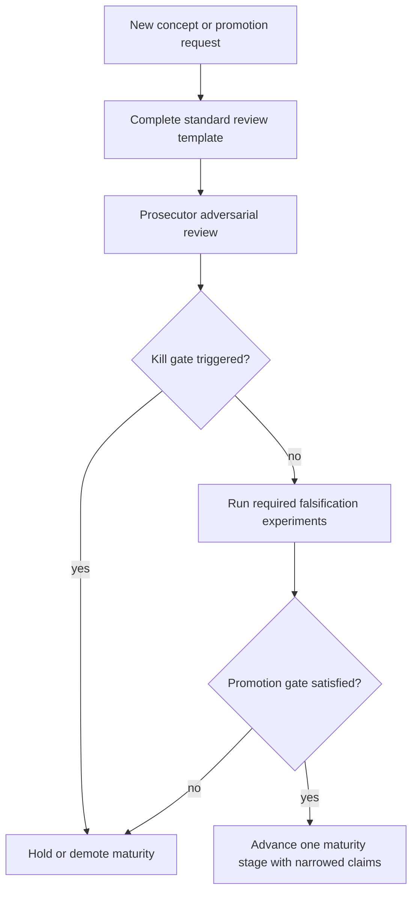

# Observatory Adversarial Framework

**Role:** Observatory Prosecutor  
**Status:** Reusable review protocol. Observation and experiment design only.  
**Guardrail:** Hermetic closure validates transport completion within a known scene contract. Observatory concepts observe and classify evidence; they do not establish physical correctness and must not feed renderer scheduling, hit selection, or optimization without separate validation.

**Premise:** Every Observatory concept is **guilty until proven innocent**. Maturity promotion is a conviction that requires falsification experiments, not artifact generation alone.

**Non-deliverables for this framework:** No renderer optimizations. No assumption that concepts are valid. No promotion without passing gates defined below.

---

## 1. Prosecutor Mandate

The Observatory accumulates maps, ladders, storyboards, and basin language. Those artifacts are easy to produce and easy to over-read. This framework exists to:

1. Separate **observable outputs** from **interpretive claims**
2. Require a **null model** before any spatial co-location or alignment claim is treated as insight
3. Define **kill gates** that demote or retire weak concepts
4. Define **promotion gates** that advance maturity only after adversarial review
5. Make **fixture selection** explicit (a concept tested only on happy-path hermetic full-coverage is not validated)

**Prosecutor default:** If a concept cannot survive on a fixture where its phenomenon exists, the concept is **fixture-selected rhetoric**, not a general Observatory primitive.

---

## 2. Standard Review Template

Copy this block for every new Observatory concept before any maturity promotion.

```markdown
## Concept: <name>

| Field | Value |
|---|---|
| **Current maturity** | <stage> (<score>) — concept / artifact if split |
| **Current trust** | <run-scoped | scene-contract | comparative | meta-governance> |
| **Strongest claim** | <one sentence — the most ambitious honest reading> |
| **Weakest surviving claim** | <one sentence — what remains if all mechanism claims fail> |
| **Null model** | <what randomness, geometry, or pipeline artifact predicts without the concept> |
| **Alternative explanations** | <numbered list — attempt to kill the concept> |
| **Failure modes** | <how the concept misleads readers> |
| **Required experiments** | <observation-only falsification battery> |
| **Kill gate** | <conditions that demote, freeze, or retire the concept> |
| **Promotion gate** | <conditions to advance one maturity stage> |
```

**Review cadence:** Adversarial review is mandatory when:
- A concept moves from Proposed (0) → Experimental (1)
- Any artifact moves from Observed (2) → Confirmed (3)
- Any artifact moves from Confirmed (3) → Characterized (4)
- Any artifact moves from Characterized (4) → Canonical (5)
- A new basin is named in [basin_taxonomy_v1.md](../docs/basin_taxonomy_v1.md)
- A storyboard or ladder headline number is used as evidence (e.g., alignment counts, disagreement %)

**Outputs of each review:**
- Completed template (this document or `reports/<concept>_survival_critique.md`)
- Explicit **allowed claims** list (narrowed if concept survives)
- Maturity recommendation with pre-registered gates

---

## 3. Cross-Cutting Prosecutor Rules

These apply to **all** basin concepts.

| Rule | Rationale |
|---|---|
| **Coverage before closure** | Closure % without traced % is a confounded claim. Always report coverage and closure orthogonally. |
| **Happy-path vacuity** | Uniform maps (100% green, 100% filled) produce zero edge alignment by construction. Zero is often uninformative, not exculpatory. |
| **Counts need rates** | Raw co-location counts (e.g., 463 seam pixels) require null-model comparison and normalization by mask density. |
| **Proxy ≠ measured** | Step count, PNG edge detection, and proportional query estimates are not per-pixel query ms. Do not infer wall-clock basins from step terrain. |
| **Comparative concepts need two instances** | Disagreement and Sensitivity require two declared perspectives/baselines. Single-run claims are invalid. |
| **Canonical ≠ true** | Score 5 means stable Observatory language within a scene contract, not physical ground truth ([observatory_trust_model.md](observatory_trust_model.md)). |
| **Presentation ≠ ontology** | Storyboards, ladders, and Query Observatory instances rearrange evidence; they do not create new measurement domains ([observatory_dependency_graph.md](observatory_dependency_graph.md)). |

**Universal null models:**
- **Scheduler null:** Row/tile band boundaries explain spatial periodicity without transport difficulty.
- **Geometry null:** Receiver projection and camera FOV explain seams, margins, and territory maps without cost or coherence claims.
- **PNG pipeline null:** Resize, chroma thresholding, and edge detection create fat boundaries and false co-location.
- **Fixture-density null:** Layers with more painted pixels (seams) align more often than sparse layers (disagreement) regardless of mechanism.

---

## 4. Concept Dossiers

Maturity scores follow [observatory_maturity_ladder.md](observatory_maturity_ladder.md) and [basin_taxonomy_v1.md](../docs/basin_taxonomy_v1.md) where concept vs. artifact maturity diverge.

---

### 4.1 Cost Basin

| Field | Value |
|---|---|
| **Current maturity** | Concept: Proposed (0). Artifact (`cost_basin` v1): Observed (2). Underlying heatmap: Observed (2). |
| **Current trust** | Run-scoped computational observation |
| **Strongest claim** | Spatial topography of computational effort predicts where closure will fail, where query work concentrates, and where optimization should focus. |
| **Weakest surviving claim** | Per-pixel `final_step_count` is non-uniform over the closure interior (descriptive scalar field). |
| **Null model** | Ridge mask co-locates with dense seam PNG at baseline rate; row banding at y≈96 explains local maxima; shallow 268–299 field makes terrain visualization overfit noise. |
| **Alternative explanations** | (1) Base-rate seam collision. (2) Shared receiver-geometry parent. (3) Row-traversal scheduler banding. (4) Structurally guaranteed six-wall seams. (5) Step proxy ≠ query bottleneck. (6) PNG rescaling bleed. |
| **Failure modes** | Readers treat 463 seam alignment as mechanism; infer query hotspots from step terrain; promote maturity from artifact generation; compare full-coverage alignment table as discriminative evidence. |
| **Required experiments** | CB-K1 null alignment; CB-K2 scheduler vs receiver variance partition; CB-K3 failure-regime ridge↔closure; CB-K4 partial-coverage predictive ordering; CB-K5 cross-fixture discrimination; CB-K6 curvature-normalized alignment rate. See [cost_basin_survival_critique.md](cost_basin_survival_critique.md). |
| **Kill gate** | Seam alignment ≤ null expectation; maxima explained by row index; no cliff correlation; normalized alignment invariant as cost spread grows → **demote to traversal heatmap alias; retire "basin" language.** |
| **Promotion gate** | **→ Confirmed (3):** CB-K1 + CB-K3 pass. **→ Characterized (4):** above + (CB-K4 or CB-K5) + ≥2 run timestamps + per-pixel query attribution or explicit "steps-only" caveat in all artifacts. |

---

### 4.2 Closure Basin

| Field | Value |
|---|---|
| **Current maturity** | Concept: Characterized (4). Artifact (hit/miss map, closure %): Characterized (4). |
| **Current trust** | Scene-contract-scoped computational invariant |
| **Strongest claim** | Closure basin interior is the authoritative partition of evaluated pixels into terminal transport states within a declared budget; 100% hermetic closure proves the renderer completed the scene contract. |
| **Weakest surviving claim** | For each traced pixel, a terminal classification label exists in `hit_diagnostics.csv` under the declared budget. |
| **Null model** | Overrun step (`budget+1`) inflates "success" without true interior convergence; partial coverage with 100% closure reports closure over a subset only; green pixels are contract satisfaction, not physics. |
| **Alternative explanations** | (1) Overrun-hit semantics absorb budget stress as valid closure. (2) Smoke-scale 72.7% stress at cap=700 masked as closure via step 701. (3) Closure measured only on traced fraction. (4) Budget is a free parameter — basin expands with cap, not scene truth. (5) Miss=0 does not imply beauty correctness or oracle agreement. |
| **Failure modes** | "100% closure" read as absolute validation; closure conflated with coverage; orange overrun pixels hidden in aggregate PASS; closure at budget=32 cliff omitted when citing plateau at budget=700. |
| **Required experiments** | CL-K1 budget sweep cliff mapping (32→700) with closure % and `budget_exhausted_without_hit`. CL-K2 coverage-orthogonal reporting (traced % alongside closure %). CL-K3 overrun semantics audit (step 701 vs 700 classification). CL-K4 cross-fixture: hermetic (expect 0 miss) vs object_island (expect partial). |
| **Kill gate** | Closure PASS cited without traced % on partial runs; overrun hits counted as interior without budget_stress disclosure; closure language used for physical accuracy → **freeze concept, demote showcase claims.** |
| **Promotion gate** | **Already Characterized (4).** **→ Canonical (5):** requires stable visitor-facing contract + automated gate in catalog + explicit overrun/coverage caveats on all published anchors. No further promotion without multi-fixture closure cliff atlas. |

---

### 4.3 Coverage Basin

| Field | Value |
|---|---|
| **Current maturity** | Concept: Proposed (0). Artifact (`frame_coverage_map`): Observed (2). |
| **Current trust** | Run-scoped precondition (not a transport claim) |
| **Strongest claim** | Coverage basin is the foundational domain; no other basin is meaningful until 100% traced and beauty-written coverage is established. |
| **Weakest surviving claim** | `frame_coverage_map` and traced/beauty fractions report which film pixels were touched by the harness in this run. |
| **Null model** | Coverage is a function of frame count, row cursor, and warmup — a **schedule artifact**, not a transport property. Identical closure can exist at 37.7% or 100% traced depending on measurement window. |
| **Alternative explanations** | (1) Partial baseline (10 frames) vs Experiment B (50 frames) regime change, not optimization. (2) `full_frame_requested` is semantic intent, not guaranteed physics. (3) Beauty-written % can lag traced %; equating them overstates visual confirmation. (4) Untraced pixels are undefined, not failed — but readers treat them as hidden misses. |
| **Failure modes** | Coverage omitted when closure is headline; full-coverage assumed for all presets; coverage maps used in edge alignment on uniform fills (vacuous zeros). |
| **Required experiments** | CV-K1 frames/warmup sweep holding scene constant (10/2 vs 50/5). CV-K2 traced vs beauty-written lag measurement. CV-K3 preset ladder: smoke → mini → SNES → tiny-HD coverage gates before cross-preset claims. CV-K4 row-completion vs `rows_completed` metadata consistency. |
| **Kill gate** | Any downstream basin promoted without declared traced % on the same run → **block promotion chain.** If coverage is purely schedule-derived with zero transport correlation, **retain as harness metric only, not "basin."** |
| **Promotion gate** | **→ Experimental (1):** schema entry + validation gate definition. **→ Observed (2):** dedicated Coverage Basin artifact with contract block. **→ Confirmed (3):** CV-K1 + CV-K3 pass for mini preset. |

---

### 4.4 Ownership Basin

| Field | Value |
|---|---|
| **Current maturity** | Concept: Proposed (0). Artifact (`transport_ownership`, `ownership_graph_seam_map`): Observed (2). |
| **Current trust** | Scene-contract-scoped, comparative territory assignment |
| **Strongest claim** | Ownership basin maps which receiver zone claimed each ray; seams mark geometrically sensitive classification boundaries that predict disagreement and coherence instability. |
| **Weakest surviving claim** | Each closure-interior pixel has a receiver/zone label in the transport ownership graph for the declared scene contract. |
| **Null model** | Six-wall hermetic geometry **requires** seam curves on the film plane at any closure level; seam density is structural, not diagnostic. Label adjacency in `draw_seam_map` marks every domain transition — seams are **complete by construction**. |
| **Alternative explanations** | (1) Ownership is post-closure labeling, orthogonal to closure success. (2) Seam width 1–3px is rasterization of continuous boundaries. (3) Seam Xeno (X-S) is observer-angle sensitivity — may disappear on camera nudge. (4) Ownership graph precision sweep shows seams stable while disagreement varies — seams are not disagreement. (5) PNG "active" mask conflates seam color with any saturated non-gray pixel. |
| **Failure modes** | Seam map treated as risk indicator on hermetic fixture; ownership mistaken for closure; seam alignment counts (463) cited as cost or coherence evidence. |
| **Required experiments** | OW-K1 seam pixel count vs film area (density baseline). OW-K2 camera micro-perturbation seam stability. OW-K3 receiver_id in CSV vs graph label consistency. OW-K4 compare hermetic (6 domains) vs curved_minimal (open backdrop) seam structure. |
| **Kill gate** | Seam alignment used as universal risk signal on sealed fixtures; ownership promotion without comparative second perspective → **remain territory map only, not "basin."** |
| **Promotion gate** | **→ Confirmed (3):** OW-K3 pass + declared receiver contract in schema. **→ Characterized (4):** OW-K2 + OW-K4 + integration with Disagreement Basin pipeline (two instances). |

---

### 4.5 Disagreement Basin

| Field | Value |
|---|---|
| **Current maturity** | Concept: Proposed (0). Artifact (Ch.2 ~23.8% divergence, `unstable_subgraph_overlay`): Observed (2). |
| **Current trust** | Scene-contract-scoped, comparative model divergence |
| **Strongest claim** | Disagreement basin locates where two valid transport perspectives assign different terminal classifications; persistent clustered disagreement marks coherence boundaries and Xeno candidates. |
| **Weakest surviving claim** | Where two declared ownership basins differ on the same covered pixel, the symmetric difference can be computed and counted. |
| **Null model** | Disagreement rate is **expected** when comparing curved vs straight transport (Ch.2 23.8%); neither side is ground truth. On hermetic full-coverage single-perspective runs, disagreement overlay is **empty by construction** — zero alignment is vacuous. |
| **Alternative explanations** | (1) Disagreement ≠ error — both models may be valid under their contracts. (2) Coverage mismatch between perspectives inflates disagreement %. (3) `unstable_subgraph_overlay` on hermetic run is oracle-stable green — not a disagreement map. (4) Spatial clustering may follow seam geometry (X-S) not independent coherence failure. (5) Single-run hermetic tests cannot produce disagreement basin at all. |
| **Failure modes** | 23.8% read as "23.8% wrong"; disagreement alignment 0 on hermetic cited as Cost Basin exculpation; unstable overlay name implies disagreement when graph is stable. |
| **Required experiments** | DG-K1 paired-perspective run (curved vs straight) with matched coverage gate. DG-K2 disagreement % vs coverage intersection size. DG-K3 spatial clustering vs seam map (X-B, X-S, X-F taxonomy). DG-K4 persistence across camera perturbation. |
| **Kill gate** | Disagreement promoted from single-perspective artifacts; disagreement % reported without both perspective names and coverage intersection → **concept remains Proposed; 23.8% stays contextual anecdote.** |
| **Promotion gate** | **→ Experimental (1):** DG-K1 pipeline with schema. **→ Confirmed (3):** DG-K1 + DG-K2 pass on matched coverage. **→ Characterized (4):** DG-K3 + DG-K4 + Xeno citation linkage documented. |

---

### 4.6 Sensitivity Basin

| Field | Value |
|---|---|
| **Current maturity** | Concept: Proposed (0). Instance (Curvature Signature / ladder): Characterized (4). |
| **Current trust** | Scene-contract-scoped, parameter-relative |
| **Strongest claim** | Sensitivity basin is the signed derivative of cost with respect to a named parameter; red regions predict closure margin pressure and future risk-node expansion. |
| **Weakest surviving claim** | Per-pixel `final_step_count(test) − final_step_count(baseline)` is computable where both closures succeeded. |
| **Null model** | Small mean delta (+5 steps 0%→100%) on shallow field; black pixels are **null delta**, not null response; signature is **fixture+camera+baseline locked** — does not generalize. Basin shift events (closure enter/exit) are excluded from signature but may dominate parameter response. |
| **Alternative explanations** | (1) Step-count delta misses query-path response. (2) Curvature changes resolved amplitude and transport on/off — not pure sensitivity. (3) Ladder stacks cells with identical coverage assumption — partial cells invalidate comparison. (4) Red ≠ incorrect (documented) but still read as failure in headlines. (5) Generalized "Sensitivity Basin" name overclaims beyond curvature instance. |
| **Failure modes** | Signature ladder promoted as universal parameter framework; black regions interpreted as "unaffected"; signature cited without declared baseline amplitude; closure shift ignored. |
| **Required experiments** | SN-K1 basin shift accounting (pixels entering/leaving closure across curvature cells). SN-K2 signature vs query_total delta correlation per cell. SN-K3 repeatability across timestamps (191143Z, 191820Z, 221311Z). SN-K4 non-curvature parameter instance (e.g., step size) to justify generalized concept name. |
| **Kill gate** | Generalized Sensitivity Basin promoted while only curvature instance exists; SN-K1 shows dominant closure shifts ignored → **retain "Curvature Signature" instance name; keep generalized basin Proposed.** |
| **Promotion gate** | **Instance stays Characterized (4).** **Generalized concept → Confirmed (3):** SN-K4 + SN-K1 reporting gate. **→ Characterized (4):** SN-K3 + second parameter family. |

---

### 4.7 Query Observatory

| Field | Value |
|---|---|
| **Current maturity** | Observed (2) — presentation artifact instance ([query_storyboard_v1.png](query_storyboard_v1.png)). Not an architectural concept ([observatory_dependency_graph.md](observatory_dependency_graph.md)). |
| **Current trust** | Run-scoped aggregate attribution (band/frame level) |
| **Strongest claim** | Query Observatory decomposes `pass2_phys_ms` into query sub-metrics and proves query is the optimization surface; it explains Cost Basin depth spatially. |
| **Weakest surviving claim** | For a given run, `pass2_query_ms` and related band aggregates exist in `latest_perf_frame_report` and can be tabulated by curvature cell. |
| **Null model** | Query dominance (92–94%) is an **aggregate ratio**, not a per-pixel map; attributing spatial Cost Basin to Query Observatory is proportional estimation, not measurement. Storyboard is one-run presentation without catalog gate. |
| **Alternative explanations** | (1) Query ms and query count lack per-pixel join key to film plane. (2) Broadphase/narrowphase lumped — decomposition incomplete. (3) Query totals decrease 0%→25% while steps rise — undermines monotonic "deeper basin = more query" story. (4) `pass2_phys_ms` cumulative vs per-frame normalization unresolved ([curvature_full_coverage_experiment.md](curvature_full_coverage_experiment.md)). (5) Instance mistaken for recurring Observatory primitive. |
| **Failure modes** | Query storyboard cited as spatial hotspot map; optimization target inferred without closure gate; promotion to anchor alongside Hermetic Storyboard without pipeline. |
| **Required experiments** | QO-K1 per-frame vs cumulative `pass2_phys_ms` normalization audit. QO-K2 query-step correlation sign across curvature ladder. QO-K3 per-pixel query field availability check (`hit_diagnostics.csv` columns). QO-K4 stable generation gate + catalog entry like `renderer_storyboard_v1`. |
| **Kill gate** | Used to justify spatial claims without QO-K3 per-pixel data; promoted to Canonical → **retire as concept; retain as optional storyboard template only.** |
| **Promotion gate** | **→ Confirmed (3):** QO-K1 + QO-K4. **→ Characterized (4):** QO-K3 satisfied OR explicit aggregate-only contract forever. Never Canonical without per-pixel join or formal aggregate-only doctrine. |

---

### 4.8 Trust Model

| Field | Value |
|---|---|
| **Current maturity** | Characterized (4) — frozen cross-cutting governance ([observatory_dependency_graph.md](observatory_dependency_graph.md)). |
| **Current trust** | Meta-governance — evidence-strength vocabulary |
| **Strongest claim** | Trust Model prevents conflation of closure, coverage, maturity, verdict, citation tier, and showcase status; Canonical is explicitly not physical truth. |
| **Weakest surviving claim** | Labels from the 0–5 axis can be applied consistently as **declared evidence strength**, not as computed outputs. |
| **Null model** | Scores are **human assignments** in catalog and curated tables — risk of grade inflation when artifacts exist (generation → Observed → implied Confirmed). Crosswalk tables multiply labels without adding measurement. |
| **Alternative explanations** | (1) Maturity Ladder duplicates Trust Model (thin wrapper). (2) PASS closure locally does not imply artifact maturity globally. (3) Showcase "Strong" read as physical validation. (4) Citation tier vs Xeno tier naming collision partially mitigated but still confused. (5) Unlabeled artifacts treated as low quality rather than unlabeled. |
| **Failure modes** | Canonical confused with true; Observed inferred from file existence; conflicting labels not surfaced with conflict rule; basin concept scores conflated with artifact scores in taxonomy. |
| **Required experiments** | TM-K1 audit: every Catalog PASS row has traced % recorded. TM-K2 conflicting labels documented per conflict rule. TM-K3 promotion events paired with adversarial review file path. TM-K4 split concept vs artifact scores in all new entries. |
| **Kill gate** | Promotion without adversarial review artifact; single PASS field auto-upgrades whole artifact → **freeze Trust Model until TM-K3 enforced procedurally.** |
| **Promotion gate** | **→ Canonical (5):** TM-K1–K4 operational in CI or release checklist + Adversarial Review required link in catalog schema. Already frozen — promotion is **procedural adoption**, not new claims. |

---

### 4.9 Maturity Ladder

| Field | Value |
|---|---|
| **Current maturity** | Experimental presentation — thin view of Trust Model ([observatory_dependency_graph.md](observatory_dependency_graph.md)). |
| **Current trust** | Meta-governance presentation |
| **Strongest claim** | Maturity Ladder ranks Observatory artifacts by evidence strength and guides visitors on what can anchor interpretation. |
| **Weakest surviving claim** | The ladder displays current curated anchor assignments and points readers to Trust Model definitions. |
| **Null model** | Ladder is a **manual table** (`observatory_maturity.py` CURATED_ASSIGNMENTS) that can drift from catalog; scores imply precision without falsification backing. |
| **Alternative explanations** | (1) Duplicate of Trust Model — unique content only anchor table. (2) Cost Basin at Observed (2) suggests validation that critique disallows. (3) Curvature Signature Characterized (4) on partial runs in catalog history — ladder reader may miss PARTIAL coverage. (4) Ladder headline encourages score comparison across incomparable fixtures. (5) No automated gate ties score to experiments. |
| **Failure modes** | Score treated as quality ranking across fixtures; Observed mistaken for recommended use; ladder updated without adversarial review; concept vs artifact scores collapsed. |
| **Required experiments** | ML-K1 auto-generate ladder from catalog + curated with conflict flags. ML-K2 every score change requires linked survival critique or adversarial review path. ML-K3 separate concept_maturity vs artifact_maturity columns (per basin taxonomy). ML-K4 publish promotion gate checklist on ladder page. |
| **Kill gate** | Independent maturity semantics introduced that diverge from Trust Model → **retire ladder as ontology; keep Trust Model only.** |
| **Promotion gate** | **→ Characterized (4):** ML-K1 + ML-K2 + ML-K4. Never Canonical — presentation view only. |

---

## 5. Maturity Promotion Protocol



**One-stage rule:** Never skip a maturity stage after a kill event. Never promote two stages on artifact generation alone.

**Narrowed claims rule:** Every promotion must ship an **allowed claims** bullet list. Strongest claim language is forbidden in visitor-facing copy unless promotion gate passed.

---

## 6. Fixture Prosecutor Matrix

Which concepts can be **killed or validated** on which fixtures.

| Fixture | Coverage | Closure | Ownership | Cost | Disagreement | Sensitivity |
|---|---|---|---|---|---|---|
| `hermetic_curved_room` mini full-coverage | Vacuous (100%) | Vacuous (100% green) | Dense seams (structural) | Shallow field | Vacuous (no second perspective) | Valid curvature ladder |
| `hermetic_curved_room` smoke / low budget | Partial | **Cliff test** | Seams present | Stress margin | N/A single perspective | Weak |
| `hermetic_curved_room` partial baseline 37.7% | **CV-K4 test** | Valid | Valid | Valid | N/A | Partial cells |
| `object_island` | Partial | Partial closure | Valid | Budget exhaustion | Oracle unstable | Weak |
| Curved vs straight paired study | Matched gate | Both must close | Two instances | Two instances | **DG-K1 primary** | N/A |

**Prosecutor rule:** A concept validated only on hermetic mini full-coverage receives **fixture-scoped** maturity only. General Observatory language requires cross-fixture gate.

---

## 7. Kill List — Weak Concepts at Risk

Concepts most vulnerable if adversarial review is applied strictly:

| Concept | Why weak today | Prosecutor recommendation |
|---|---|---|
| **Cost Basin** (strong form) | Step proxy, alignment tautology, query mismatch | Hold Observed (2); kill terrain/ridge claims without CB-K1 |
| **Coverage Basin** (as basin) | May be harness schedule metric only | Promote precondition language; delay "basin" until CV-K3 |
| **Ownership Basin** (as risk signal) | Seams guaranteed on hermetic | Territory map yes; risk predictor no without OW-K2 |
| **Disagreement Basin** | Requires two perspectives; hermetic gives zero | Stay Proposed until DG-K1 |
| **Sensitivity Basin** (generalized) | Only curvature instance characterized | Rename public copy to Curvature Signature until SN-K4 |
| **Query Observatory** (as concept) | Single aggregate storyboard | Presentation instance only; not anchor |
| **Maturity Ladder** (as ontology) | Duplicates Trust Model | Thin view only |

**Concepts that survive aggressive critique (narrow form):**
- **Closure Basin** — with budget/coverage/overrun caveats
- **Trust Model** — if TM-K3 procedural enforcement adopted
- **Curvature Signature** (Sensitivity instance) — with baseline and basin-shift caveats

---

## 8. Future Concept Intake

When a new Observatory concept is proposed:

1. Classify: FOUNDATIONAL / DERIVED / CROSS-CUTTING / PRESENTATION ([observatory_dependency_graph.md](observatory_dependency_graph.md))
2. Complete standard review template (Section 2)
3. Assign **Proposed (0)** until at least one falsification experiment is defined
4. Register in [basin_taxonomy_v1.md](../docs/basin_taxonomy_v1.md) or dependency graph — not both with conflicting edges
5. Block catalog PASS if adversarial review path is missing (TM-K3)
6. Do not cite alignment counts, disagreement %, or ladder scalars without null model

**Automatic reject flags:**
- Concept name duplicates existing panel without new measurement domain
- Single-run comparative claim (Disagreement/Sensitivity pattern)
- Spatial optimization target language in concept definition
- "Canonical" requested without scene-contract scope statement

---

## 9. References

| Document | Role |
|---|---|
| [basin_taxonomy_v1.md](../docs/basin_taxonomy_v1.md) | Basin ontology and concept vs artifact maturity |
| [basin_atlas_v1.md](../docs/basin_atlas_v1.md) | Closure/Cost/Coherence/Sensitivity/Risk relationships |
| [observatory_trust_model.md](observatory_trust_model.md) | Evidence-strength axis |
| [observatory_maturity_ladder.md](observatory_maturity_ladder.md) | Current anchor scores |
| [observatory_dependency_graph.md](observatory_dependency_graph.md) | Concept classification and duplication risk |
| [cost_basin_survival_critique.md](cost_basin_survival_critique.md) | Worked example — Cost Basin prosecution |

---

**End of framework.** Observation only. No renderer optimizations. Concepts remain guilty until innocence is demonstrated through falsification gates, not narrative agreement.